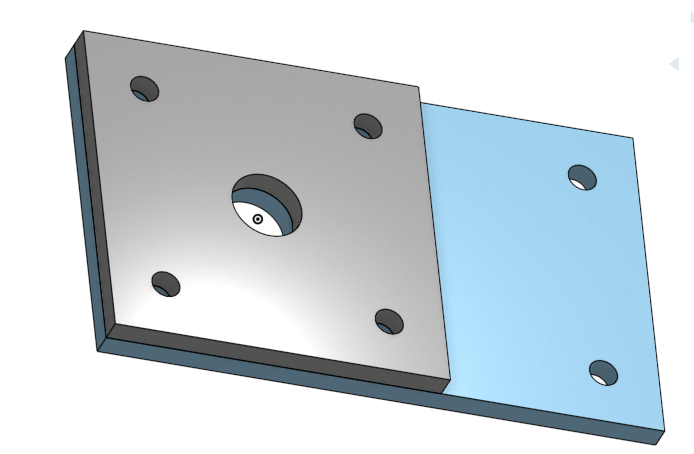

# MountCAD

## Assignment

Making the mount for the caster in Onshape

## Picture

## Reflection

I struggled with the extrusion because I did my mount a little different than the instruction. I used the same documen as my base and just added on to it. I tried extruding the sketch, but I ended up only extriding the walls and not the middle of my mount. I figured it out by retracing my steps and found out what I did wrong. I am 2/3 of the way done with this assignment of making the caster.

## Onshape Document Link

https://cad.onshape.com/documents/552a75c83439016c914fcabd/w/2f696d226eafe0c0d9923517/e/b7ff6d136de01bbe54c19693
